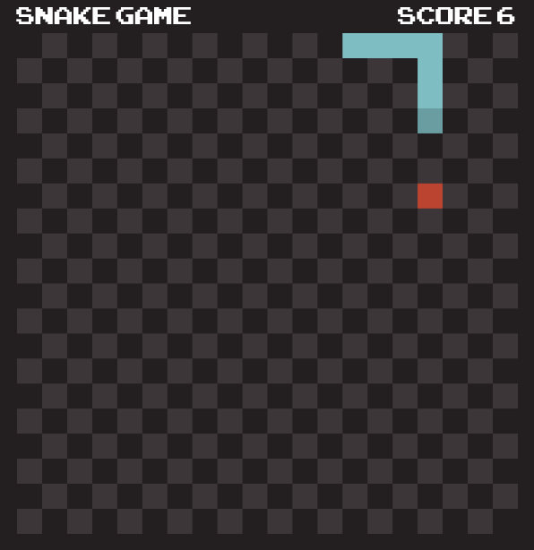

  
## Overview
This is a classic Snake game implemented in Node.js, designed to run on a Ubuntu virtual machine.
The game leverages the simplicity and efficiency of Node.js for server-side logic while utilizing web technologies for the frontend.

## Features
- Responsive and intuitive controls for seamless gameplay.</li>
- Score tracking to monitor your progress.</li>
- Game over screen with the option to restart.</li>

## Technologies
The project was created using:

- node v18.17.1
- npm 9.6.7

## Setting up the environment
### Prerequisities
Node.js installed on your Ubuntu virtual machine. If not, you can download it [here](https://nodejs.org/en).

1. Clone this repository 
```git clone https://github.com/mateja-velickovic/nodejs-snakeGame.git```

2. Navigate to the project directory
```cd nodejs-snakeGame```

3. Install dependecies
```npm install```

4. Run the game
```npm run dev```

5. Open your web browser and visit <a target="_blank" href="http://localhost:5173/">http://localhost:5173/</a> to play the Snake game.

## Controls
Use arrow keys (Up, Down, Left, Right) to control the snake's direction.
